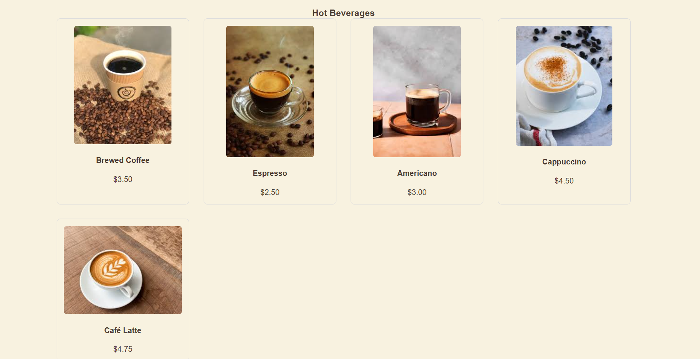
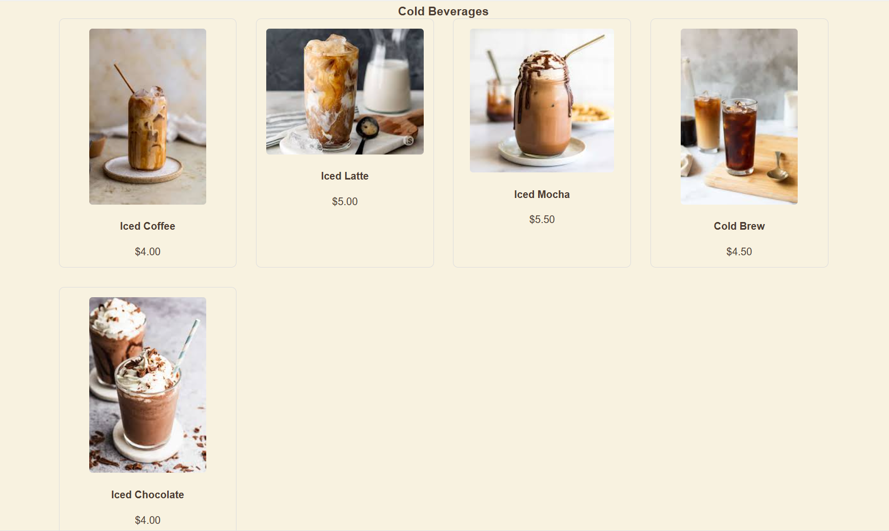
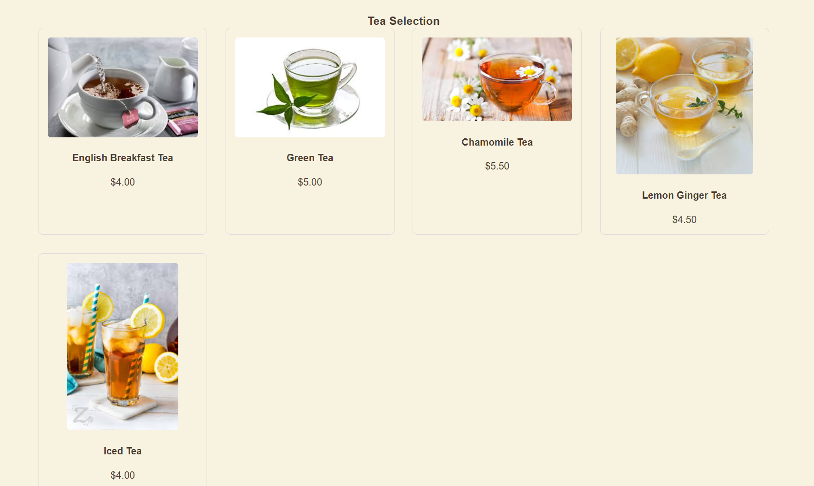

# Frice-CozyCup Cafe

## Project Description

Frice-CozyCup Cafe is a simple and visually appealing café website designed to showcase the café’s brand, menu, and atmosphere. The project focuses on providing users with a warm and cozy browsing experience while allowing them to explore available beverages, learn about the café, and view contact information easily.

## Features

* Clean and cozy café-themed user interface

* Home page with welcoming hero section and call-to-action button

* Menu section displaying beverages with images and prices

* About Us section describing the café’s vision and atmosphere

* Contact section with email information

* Simple navigation for smooth user experience

* Responsive layout suitable for different screen sizes

## Screen Captures

1. This is the logo of our business.

2. This is our menu for our Hot Beverages

3. This is our menu for our Cold Beverages

4. This is our menu for our Tea.

## Home Page

This page welcomes users with a cozy café introduction and a button to explore the menu.

## Menu Section

Displays the available beverages with images, names, and prices in a clean layout.

## About Us Section

Provides information about the café’s mission, values, and relaxing environment.

## Contact Section

Allows users to easily find contact details for inquiries and feedback.

## About the Authors

Names: Frilyn Alicos & Ace Carl Dela Cruz

Email: Frice@gmail.com