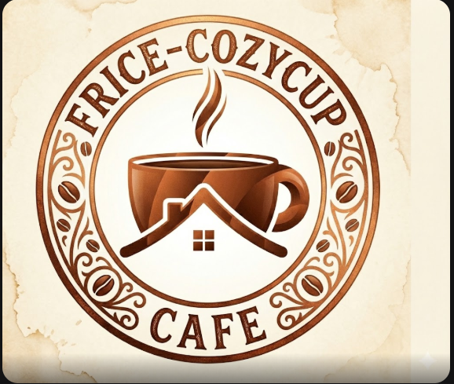
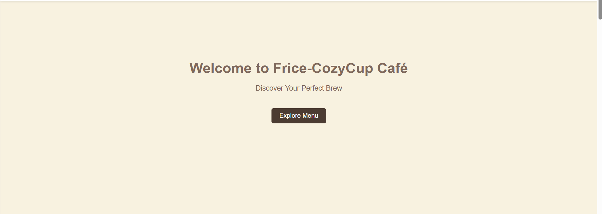
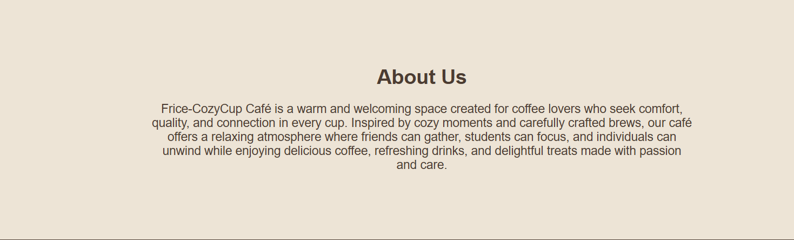
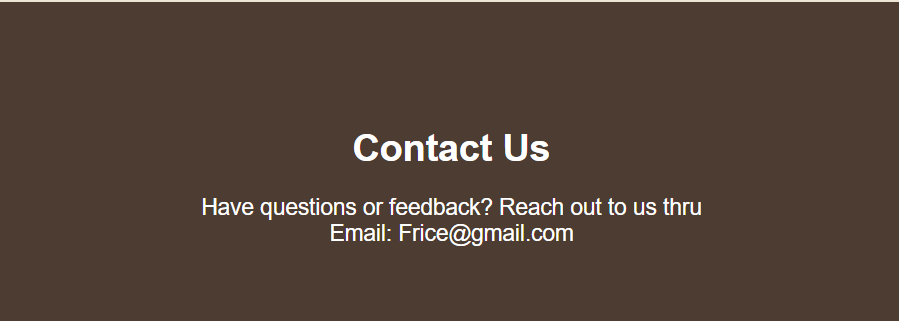

# Frice-CozyCup Cafe

## Project Description

Frice-CozyCup Cafe is a simple and visually appealing café website designed to showcase the café’s brand, menu, and atmosphere. The project focuses on providing users with a warm and cozy browsing experience while allowing them to explore available beverages, learn about the café, and view contact information easily.

## Features

* Clean and cozy café-themed user interface

* Home page with welcoming hero section and call-to-action button

* Menu section displaying beverages with images and prices

* About Us section describing the café’s vision and atmosphere

* Contact section with email information

* Simple navigation for smooth user experience

* Responsive layout suitable for different screen sizes

## Screen Captures

### Logo

This is the logo of our business.

### Home Page

This page welcomes users with a cozy café introduction and a button to explore the menu.

### Menu Section

Displays the available beverages with images, names, and prices in a clean layout.

### About Us Section

Provides information about the café’s mission, values, and relaxing environment.

### Contact Section

Allows users to easily find contact details for inquiries and feedback.

## About the Authors

<b>Names:</b> Frilyn Alicos   
<b>Email:</b> 202380114@psu.palawan.edu.ph

<b>Names:</b> Ace Carl Dela Cruz   
<b>Email:</b> 202380159@psu.palawan.edu.ph

